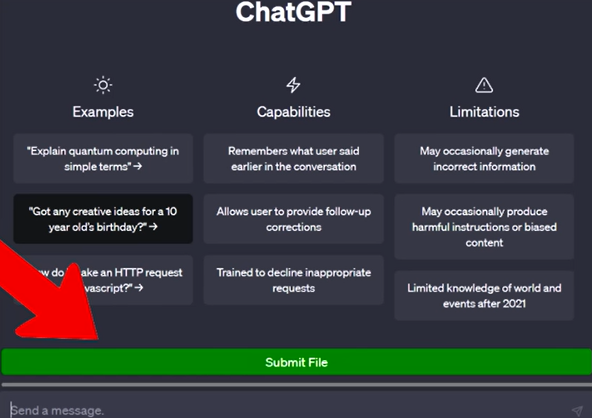
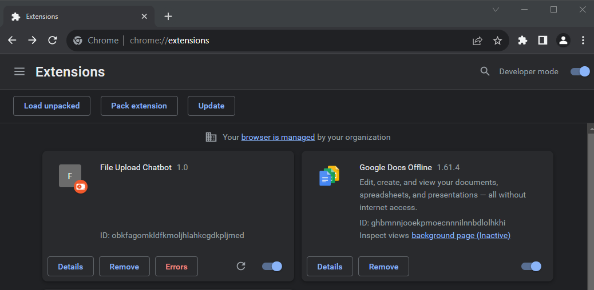

# ChatGPTFileuploadChromeExtension

This extension will place a file upload for you on the ChatGPT website. Allow you to process your own scripts, files, documents, code, database and more in chat. Allow ChatGPT to work with your own data, answering questions, giving suggestions and updating the file. Full Props goes to  "Automate My Life" on Youtube, for the great code.

Install the Firefox plugin, you can follow these steps:

1. Create a new directory for your plugin and place the `manifest.json`, `background.js`, and `content.js` files inside that directory.
2. Compress the contents of the directory into a ZIP file.
3. Open Firefox and type `about:debugging` in the address bar.
4. Click on the "This Firefox" tab in the sidebar.
5. Click the "Load Temporary Add-on" button.
6. In the file selection dialog, locate and select the ZIP file you created earlier.
7. Firefox will load the plugin temporarily, and you should see it listed in the "Temporary Extensions" section.
8. The plugin will now be active, and you can test it on any webpage that matches the specified URL pattern in the `manifest.json` file.
9. Go to the ChatGPT website, you will now have a File upload Button.
10. The loading indicator shows how much has been uploaded as the script breaks the file into chunks to stay within the character limits of ChatGPT.

* Note: Currently Extension must added again, each time the browser is restarted.

